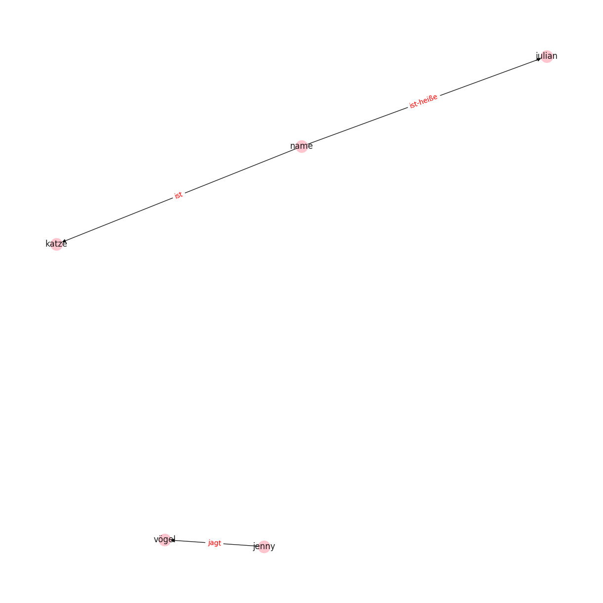

[](https://dl.circleci.com/status-badge/redirect/circleci/BbJs9oTbCH7LLiezNiXJW9/D3eKhPg3Et8a8GG6FsKHdm/tree/circleci-project-setup)

[](https://www.gnu.org/licenses/agpl-3.0)
# graphpak - building knowledge graphs (quick and dirty)

This package aims to evolve into a handy tool for building knowledge graph - like
structures from different text sources, fast, unsupervised and reusable in various
downstream tasks. 

Its initial version is intended as a very simple and heuristic tool for approaching
this task for German text sources (not yet linking all entities). The package provides 
a very simple visualization tool (building on pandas, networkx and matplotlib) and 
a serializer to dump collected data into csv files.

The core of the package relies on spacy and the publicly available german models
that spacy provides. To make use of the tool, spacy must be installed alongside 
the `de_core_news_sm` model.

In future iterations, less heuristic and more model-driven approaches will be made
available building upon open-source software, research materials and papers. The goal
will be to provide a lightweight, reusable and accessible tool for various downstream
purposes.

## Example command line use:

```bash
graphpak --text "Ich heiße Julian und ich habe eine Katze, deren Name ist Jenny. Jenny jagt gerne Vögel."
```

Would yield the not yet perfect result:



Build start: January 2024
